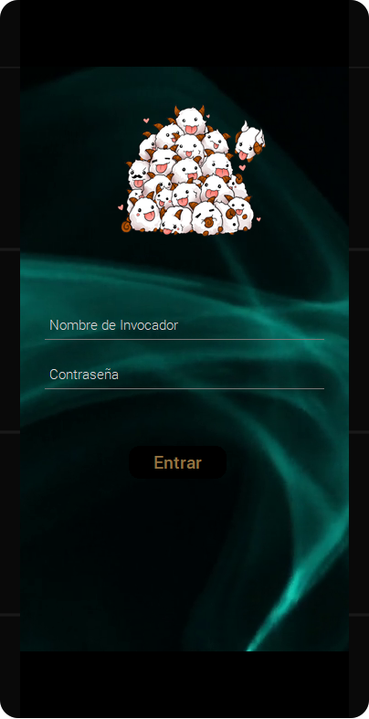

 # Hackathon Laboratoria 2018

_Con la temática  de entretenimiento crearemos soluciones/productos utilizando un API_
***
** Tema : League of Legends  para principiantes**

## Problemática actual

Ser un gamer significa ser alguien que se dedica a los videojuegos y a su cultura.
Un gamer pasa mucho tiempo practicando el juego elegido para dominar el estilo de vida.
Como en toda actividad nadie nace conociendo todo lo necesario del tema y es un poco frustrante ya que no siempre es sencillo encontrar la documentacion necesaria o bien explicada, ademas si tomamos en cuenta que los juegos requieren mucha habilidad y estrategia siempre es necesario conocer el background, la historia detras de los personajes y sus habilidades, destresas y puntos debiles para potenciar la experiencia.

>Nuestro team conformado por:
* Indira Sarahi Ruiz Lopez
* Miriam Perez
* Orquidia Campos
* Sandra Pantoja

#### Definición, delimitación y planeación.

Despues de analizar la problematica y mediante una lluvia de ideas nuestro team a decidido crear una app en la cual los gamers que apenas se integran a la comunidad puedan encontrar herramientas e informacion necesaria para avanzar y adentrarse de una manera mas eficiente al mundo de Lol.

### *Objetivo*

# *Lol 4New Bees ayudara a los nuevos usuarios de Lol a encontrar tips que les permitan conocer el mundo League of leyends y tener mas exito en sus jugadas.

* Proporcionara informacion de vocavulario
* Incluira tips acerca de los combos y mejores jugadas
* Dara a los usuarios informacion sobre los campeones asi como sus puntos a destacar

*Historia de usuarios*

 ### *Mock-up Ux*

